<div style="height: 80vh; display: flex; flex-direction: column; justify-content: center; align-items: center; text-align: center;">
    <h1 style="font-size: 3em; margin: 0;">PROJET PIF</h1>
    <p style="font-size: 2em; color: #555;">Rapport de projet</p>
    <div style="margin-top: 50px;">
        <strong>Réalisé par :</strong> Loïc Sainton et Nicolas Miekisiak<br>
    </div>
</div>

<div style="page-break-after: always;"></div>

<div style="height: 80vh; display: flex; flex-direction: column; justify-content: center; align-items: center; text-align: center;">
    <h1 style="font-size: 2.5em; margin: 0;">SOMMAIRE</h1>
    <ul style="list-style: none; padding: 0; margin-top: 24px; text-align: center; line-height: 1.8;">
        <li><a href="#introduction"><strong>Introduction au Projet PIF</strong></a> - page 3 à 4</li>
        <li><a href="#convertisseur-intro"><strong>Convertisseur - Introduction</strong></a> - page 5</li>
        <li><a href="#convertisseur-select"><strong>Convertisseur - Sélection du fichier et de la destination</strong></a> - page 6</li>
        <li><a href="#convertisseur-arbre"><strong>Convertisseur - Arbre</strong></a> - page 7</li>
        <li><a href="#convertisseur-table"><strong>Convertisseur - Table des codes</strong></a> - page 8</li>
        <li><a href="#convertisseur-creation"><strong>Convertisseur - Création du PIF</strong></a> - page 9</li>
        <li><a href="#convertisseur-classes"><strong>Convertisseur - Diagramme de classes</strong></a> - page 10</li>
        <li><a href="#visualisateur-intro"><strong>Visualisateur - Introduction</strong></a> - page 11</li>
        <li><a href="#visualisateur-select"><strong>Visualisateur - Sélection du fichier</strong></a> - page 12</li>
        <li><a href="#visualisateur-lecture"><strong>Visualisateur - Lecture du fichier</strong></a> - page 13</li>
        <li><a href="#visualisateur-arbre"><strong>Visualisateur - Construction des arbres de décodage</strong></a> - page 14-15</li>
        <li><a href="#visualisateur-decodage"><strong>Visualisateur - Décodage des pixels</strong></a> - page 16</li>
        <li><a href="#visualisateur-affichage"><strong>Visualisateur - Affichage de l'image</strong></a> - page 17</li>
        <li><a href="#visualisateur-classes"><strong>Visualisateur - Diagramme de classes</strong></a> - page 18</li>
        <li><a href="#exemple-usage"><strong>Exemple d'usage (Makefile)</strong></a> - page 19</li>
    </ul>
</div>

<div style="page-break-after: always;"></div>
<a id="introduction"></a>

# Introduction au Projet PIF

Ce projet consiste à créer un nouveau format d'image appelé **PIF (Primitive Image Format)**. Le but principal est d'apprendre à compresser une image à l'aide du codage de Huffman. Il faut comprendre le codage et le décodage pour créer le convertisseur et le visualisateur.

## Le concept du codage de Huffman

Le codage de Huffman est une technique qui permet de compresser des données en créant un arbre binaire basé sur des poids.

### 1. Préparation de l'arbre
On commence par compter combien de fois chaque élément (chaque composante couleur) apparaît. Chaque élément devient une feuille de l'arbre, et on lui donne un poids correspondant à son nombre d'apparitions (sa fréquence).

### 2. Construction de l'arbre
On construit l'arbre en partant du bas :
* On cherche les deux nœuds qui ont les plus petits poids.
* On les rassemble pour créer un nouveau nœud. Le poids de ce nouveau nœud est égal à la somme des poids de ses deux enfants.
* On recommence cette étape avec les nœuds restants jusqu'à ce qu'il ne reste plus que la racine de l'arbre.


### 3. Codage : Le chemin binaire
Une fois l'arbre terminé, on attribue une valeur à chaque direction :
* Chaque branche qui part vers la **gauche** reçoit le chiffre **0**.
* Chaque branche qui part vers la **droite** reçoit le chiffre **1**.

Pour obtenir le code final d'une couleur, il suffit de suivre le chemin depuis la racine jusqu'à la feuille de cette couleur. On note les 0 et les 1 rencontrés en route.

<div style="page-break-after: always;"></div>

# Introduction au Projet PIF

## Structure du fichier .pif

Le fichier .pif est organisé de manière très stricte pour permettre au visualisateur de reconstruire l'image pixel par pixel. Il se découpe en trois grandes parties :

| Partie | Position | Taille | Description |
|:-------|:---------|:-------|:------------|
| **En-tête** | Octets 1 à 4 | 4 octets | Dimensions de l'image (2 octets Largeur / 2 octets Hauteur) |
| **Tables de codes** | Octets 5 à 772 | 768 octets | Longueurs des codes pour les 3 composantes (Rouge, Vert, Bleu) |
| **Pixels** | Octets 773 à la fin | Variable | Suite de bits (0 et 1) représentant les pixels compressés |

## Les outils du projet

Le projet se divise en deux applications complémentaires qui permettent de manipuler le format PIF :

### 1. Le Convertisseur (Encodeur)

C'est l'outil de création. Son rôle est de transformer une image classique (`ImageIO`) en un fichier compressé `.pif`.

- **Analyse** : calcule la fréquence de chaque couleur pour créer l'arbre de Huffman.
- **Encodage** : génère les codes canoniques.
- **Interface** : affiche à l'utilisateur son image et les tables de fréquences avant de sauvegarder le fichier.

### 2. Le Visualisateur (Décodeur)

C'est l'outil de lecture. Il permet d'ouvrir un fichier `.pif` pour afficher l'image à l'écran.

- **Analyse** : lit l'image et l'interprète. 
- **Décodage** : recrée l'arbre de Huffman et décode la séquence de pixels.
- **Interface** : gère une fenêtre redimensionnable et permet de se déplacer dans l'image à la souris (drag-and-drop) si celle-ci est plus grande que l'écran.

<div style="page-break-after: always;"></div>
<a id="convertisseur-intro"></a>

# Convertisseur - Introduction

Le convertisseur est l'outil qui va convertir une image fournie au format `PIF`.

Dans la fenêtre principale du convertisseur il y a l'image, redimensionnée si nécessaire, un bouton fermer et un bouton convertir pour convertir l'image ; mais il y a aussi trois autres boutons, chacun d'entre eux permet de consulter l'ensemble des tables d'une couleur (rouge, vert ou bleu) dans une nouvelle fenêtre.

> À noter que l'image est aussi redimensionnée si elle est trop petite pour la fenêtre.

Voici un exemple de la fenêtre principale avec une image 8x8 :

<div style="display: flex; gap: 10px; justify-content: center;">
    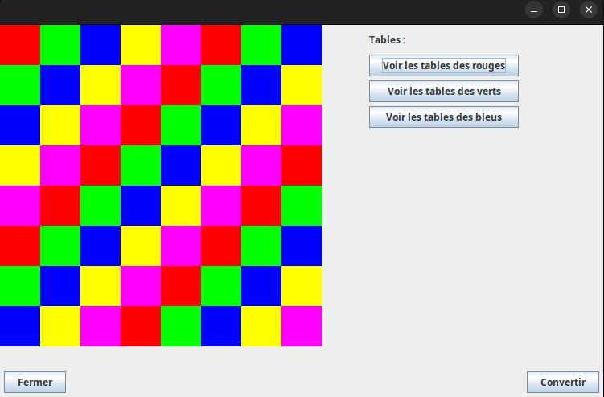
</div>

Et voici un exemple d'une fenêtre de l'ensemble des tables de la couleur rouge pour la photo ci-dessous :
<div style="display: flex; gap: 10px; justify-content: center;">
    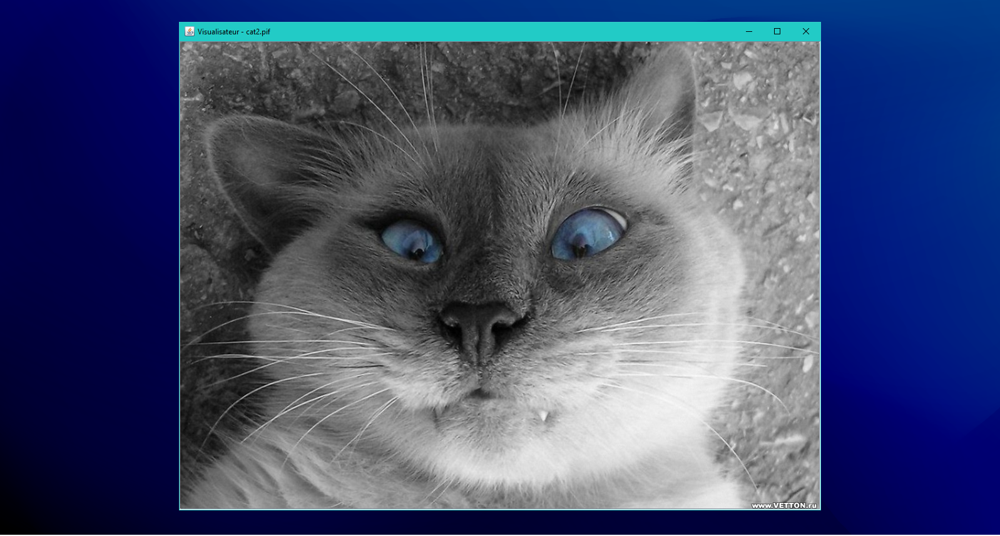
    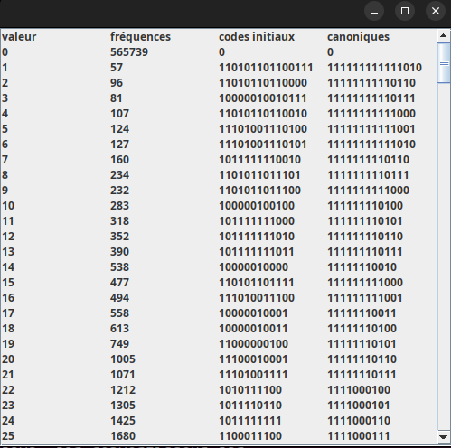
</div>

<div style="page-break-after: always;"></div>
<a id="convertisseur-select"></a>

# Convertisseur - Sélection du fichier / de la destination

##  Sélection du fichier
Le début peut se dérouler de deux manières :

- On ne donne aucun argument en entrée (<a href="#exemple-usage"><strong>voir Exemple d'usage</strong></a>) puis on choisit l'image que l'on veut potentiellement convertir grâce à l'interface du `JFileChooser`.
- On lance l'application directement avec une image en premier argument (<a href="#exemple-usage"><strong>voir Exemple d'usage</strong></a>).

Quel que soit la méthode pour passer l'image à l'application, si celle-ci est valide, alors on passe directement à l'étape d'après. Si l'image n'est pas compatible, alors l'application se coupe.

##  Sélection de la destination
La première étape de la conversion peut se dérouler de deux manières :

- On ne donne aucun argument en entrée (<a href="#exemple-usage"><strong>voir Exemple d'usage</strong></a>) puis on choisit la destination grâce à l'interface du `JFileChooser`.
- On lance l'application directement avec un chemin en deuxième argument (<a href="#exemple-usage"><strong>voir Exemple d'usage</strong></a>).

Quel que soit la méthode pour passer la destination à l'application, si celle-ci est valide, alors on passe directement à l'étape d'après. Si l'image n'est pas de la bonne extension, alors l'application se coupe.

> Remarque : Pour préciser une destination en argument il est obligatoire d'avoir mis en premier argument l'image que vous voulez convertir.

Voici un exemple de ce à quoi ressemble la page du JFileChooser lorsqu'il est appelé :
<div style="text-align: center; margin-top: 20px;">
    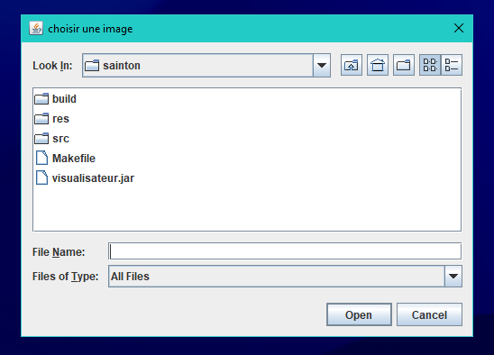
</div>


<div style="page-break-after: always;"></div>
<a id="convertisseur-arbre"></a>

# Convertisseur - Arbre

Dans le convertisseur l'arbre est utilisé pour passer du tableau de fréquence au tableau de code, en effet c'est à partir de lui que l'on va générer les codes initiaux.

L'arbre dans le programme est divisé en deux classes : 

- La classe `Noeud` qui représente un nœud quelconque ayant une couleur (ou non), une frequence et deux fils potentiels qui sont eux aussi de la classe Noeud.
- La classe `Arbre` qui s'occupe de retenir le Noeud racine et de générer l'arbre.

Voici un exemple d'arbre binaire avec sa representation en diagramme d'objets dans notre programme :

<div style="display: flex; gap: 10px; justify-content: center;">
    
    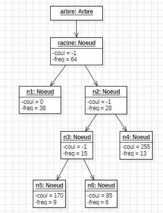
</div>

> Remarque : l'arbre de la classe Arbre peut soit être généré à l'aide d'une PriorityQueue soit simplement défini via une racine.

<div style="page-break-after: always;"></div>
<a id="convertisseur-table"></a>

# Convertisseur - Table des codes

Dans notre programme les tables des codes, c'est à dire initiaux et canoniques sont tous deux des instances de la classe `TableCode`.

Cette classe a pour attribut unique une `List` de `PaireValCode` et peut être générée grâce à une List déjà existante ou grâce à un objet de la classe Arbre.

La classe `PaireValCode` contient une valeur et le code qui lui est associé en String, l'utilisation d'un String permet une manipulation du code beaucoup plus simple et intuitive.

Pour passer de la table des codes initiaux à la table des codes canoniques, on utilise la fonction `GenererCanonique()` qui renvoie une nouvelle instance de TableCode. Le +1 en binaire nécessaire lors de la transformation s'effectue très simplement avec un String :
- On part de la fin du String et on le "parcourt" vers la gauche tant que l'on ne trouve pas de 0;
- Une fois qu'on trouve un 0, on le met à 1;
- Ceci étant fait, on repart dans l'autre sens et on met tous les 1 vus précédemment à 0.

Voici un exemple de comment cela fonctionne avec 45951 qui vaut en binaire "1011001101111111" :

<div style="text-align: center; margin-top: 20px;">
    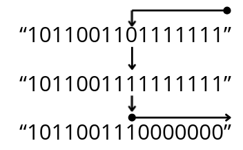
</div>

Et finalement, "1011001110000000" en base 2 vaut bien 45952 en base 10.

> Elle n'est pas parfaite car elle est incapable de rajouter un caractère si jamais on lui donne un code composé seulement de 1, mais dans l'utilisation interne, il est impossible qu'un code passé en paramètre de cette méthode soit ainsi.

<div style="page-break-after: always;"></div>
<a id="convertisseur-creation"></a>

# Convertisseur - Création du PIF

La création de l'image en `.pif` est entièrement gérée par la classe `GenerateurPif`, le fonctionnement du générateur est le suivant :
- On écrit l'en-tête dans le fichier destination;
- On parcourt chaque pixel de l'image, en récupérant le rgb;
- Puis on ajoute les codes canoniques de chaque composante dans l'ordre rouge,vert,bleu.

Pour ce faire le programme utilise un tableau de `byte` qu'il remplit au fur et à mesure, si le tableau est rempli on écrit son contenu dans le fichier destination et on le vide.

Chaque `byte` peut contenir un code entier, une partie d'un ou plusieurs code(s) ou les deux en même temps, le principe repose sur le fait que tous les codes soient au final concaténés dans le tableau pour ne laisser place à aucun bit de trop dans le fichier.

Pour ce faire, lors de chaque ajout d'une composante on suit le principe suivant :
<div style="text-align: center; margin-top: 20px;">
    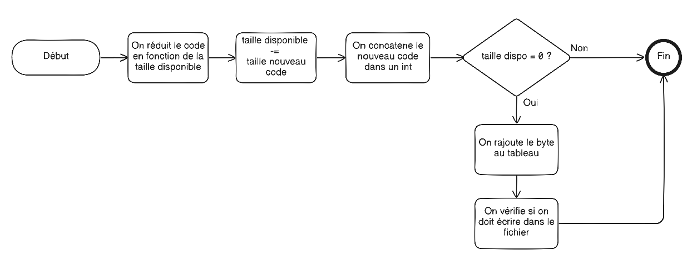
</div>

<div style="page-break-after: always;"></div>
<a id="convertisseur-classes"></a>

# Convertisseur - diagramme de classes

<div style="text-align: center; margin-top: 20px;">
    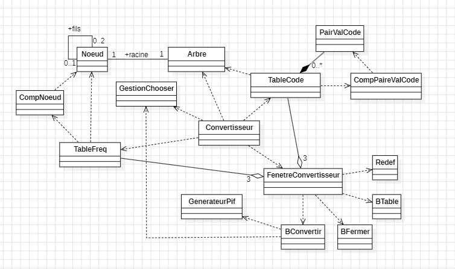
</div>

## Description des classes

- **Convertisseur** : Classe principale du programme elle agit comme le contrôleur de l'application.
- **FenetreConvertisseur** : Fenêtre Swing qui permet de consulter l'image et les calculs effectués en plus de permettre de convertir celle-ci.
- **TableFreq** : Classe qui représente une table de fréquences.
- **TableCode** : Classe qui représente une table de codes (initiaux ou canonique).
- **Arbre** : Structure de l'arbre
- **Noeud** : Element de l'arbre.
- **CompNoeud** : Comparateur qui permet de comparer des Noeud entre eux.
- **PaireValCode** : Classe représentant une paire (valeur, code).
- **CompPaireValCode** : Comparateur qui permet de comparer des PaireValCode entre eux.
- **GestionChooser** : Classe statique qui gère l'interaction avec le `JFileChooser`.
- **GenerateurPif** : Classe qui s'occupe de générer le fichier `.pif`.
- **BFermer** : ActionListener qui permet de fermer la fenêtre.
- **BConvertir** : ActionListener qui permet d'initier la conversion de l'image.
- **BTable** : ActionListener qui permet d'afficher l'ensemble des tables d'une composante R,G ou B.
- **Redef** : Redefinition d'un paintComponent pour afficher l'image.

<div style="page-break-after: always;"></div>
<a id="visualisateur-intro"></a>

# Visualisateur - Introduction

Le visualisateur est l'outil qui permet de voir l'image en `.pif` générée grâce au convertisseur. 

En outre le fait que cela affiche l'image, la fenêtre est redimensionnable, s'adapte à la taille de l'image et donc permet de se déplacer dans l'image à la souris (drag-and-drop) si celle-ci est plus grande que l'écran.

> À noter qu'une marge de 50 pixels est appliquée à gauche et à droite de l'écran, et de 75 pixels en haut et en bas, pour éviter que l'affichage ne déborde.


Ceci est un exemple d'image assez petite qui rentre dans le cadre de la fenêtre :

<div style="display: flex; gap: 10px; justify-content: center;">
    
</div>
Et Ceci est un exemple d'image qui est plus grande que le cadre de la fenêtre. Évidemment, il suffit d'utiliser le système de drag and drop (maintenir le bouton gauche enfoncé) pour se déplacer sur l'image, voici un petit exemple : 

<div style="display: flex; gap: 10px; justify-content: center;">
    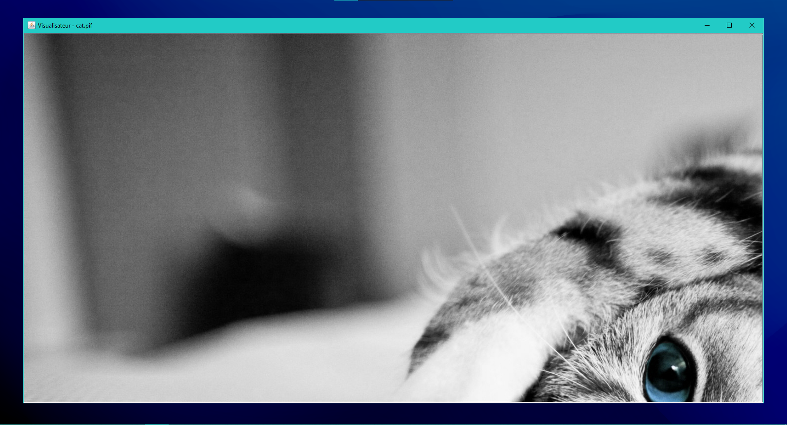
    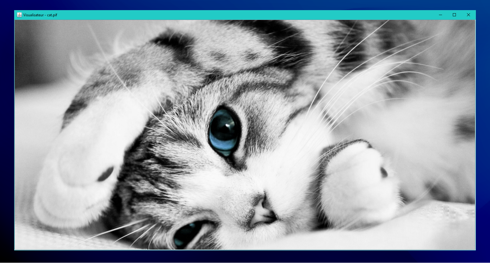
</div>

Voici la structure globale simplifiée pour le visualisateur et son fonctionnement étape par étape :

<div style="display: flex; gap: 10px; justify-content: center;">
    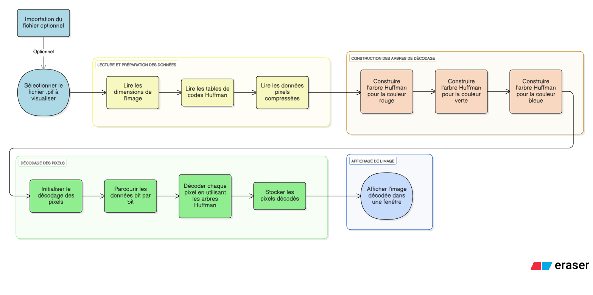
</div>


<div style="page-break-after: always;"></div>
<a id="visualisateur-select"></a>

# Visualisateur - Sélection du fichier  

La première étape est très courte : c'est  le point d'entrée de l'application où l'utilisateur doit choisir une image `.pif` pour la visualiser. Pour ce faire, l'utilisateur a deux méthodes : 

- On lance l'application sans argument (<a href="#exemple-usage"><strong>voir Exemple d'usage</strong></a>) puis on choisit une image `.pif` qu'on veut visualiser grâce à l'interface du `JFileChooser`.
- On lance l'application directement avec une image en argument (<a href="#exemple-usage"><strong>voir Exemple d'usage</strong></a>).

Quel que soit la méthode pour passer l'image à l'application, si celle-ci est valide (si c'est une image `.pif`), alors on passe directement à l'étape d'après. Si l'image n'est pas de la bonne extension, alors l'application se coupe.

<div style="text-align: center; margin-top: 20px;">
    
</div>

> Le `JFileChooser` s'ouvre dans le dossier où se situe le `.jar`. 

<div style="page-break-after: always;"></div>
<a id="visualisateur-lecture"></a>

# Visualisateur - Lecture du fichier

Une fois l'image sélectionnée, on passe à sa lecture. Cette lecture se déroule en plusieurs étapes simples. Voici un logigramme qui détaille cette lecture :

<div style="text-align: center; margin-top: 20px;">
    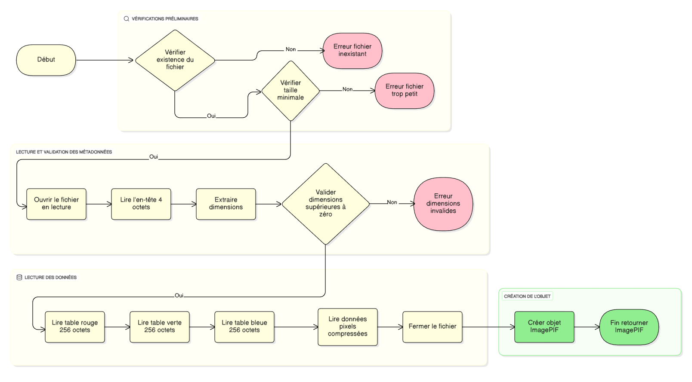
</div>

Donc pour résumer, une fois le fichier choisi, on vérifie s'il est valide, si oui, on lit l'en-tête pour récupérer les dimensions de l'image, si elles sont valides, on lit les tables de codes et les pixels compressés. et enfin, on crée l'objet ImagePIF qui contient toutes les données de l'image et cet objet est ensuite utilisé pour la suite du code.

La lecture du fichier se situe dans la classe statique `LecteurPIF.java`, qui retourne un objet `ImagePIF.java`.

<div style="page-break-after: always;"></div>
<a id="visualisateur-arbre"></a>

# Visualisateur - Construction des arbres de décodage

Une fois l'objet `ImagePIF.java` créé, on passe à la construction des trois arbres binaires de Huffman le rouge, le vert et le bleu.

## Principe de décodage

Le décodage consiste à parcourir l'arbre depuis la racine : chaque bit **0** donne l'enfant gauche et chaque bit **1** à l'enfant droit. Lorsqu'une feuille est atteinte, on obtient la valeur de la couleur et on recommence l'opération pour le pixel suivant.
Le but ici est donc de réaliser cet arbre depuis les données des tables de codes.

## Comment on construit l'arbre ?

### Étape 1 : Préparation
- On commence avec la **table de longueurs** (256 valeurs, une pour chaque couleur de 0 à 255)
- On crée des **paires (longueur, valeur)** pour chaque couleur qui a un code
  - Exemple : `(3, 42)` signifie "la couleur 42 a un code de 3 bits"
- On **trie ces paires** par longueur croissante (les codes courts en premier)

### Étape 2 : Boucle de construction
Pour chaque paire dans la liste triée, on répète :

1. **Calculer le code binaire** : On génère le prochain code canonique

2. **Insérer dans l'arbre** : On suit le code bit par bit depuis la racine (**0** → on va à gauche , **1** → on va à droite)
   
3. **Arrivé au bout du code** → on marque ce nœud avec la **valeur de la couleur**

Une fois que la liste de paire est vide, l'arbre est construit et on peut passer à la suite. Cette étape est répétée 3 fois, pour les 3 couleurs. Au niveau du code, l'appel à la méthode `HuffmanDecodeur.construireArbreCanonique()` est faite dans le constructeur de sa classe directement, puisque le constructeur prend en argument les trois tableaux de couleurs. 

<div style="page-break-after: always;"></div>

# Visualisateur - Construction des arbres de décodage

Voici un logigramme illustrant ce qui a été dit plus haut : 

<div style="text-align: center; margin-top: 20px;">
    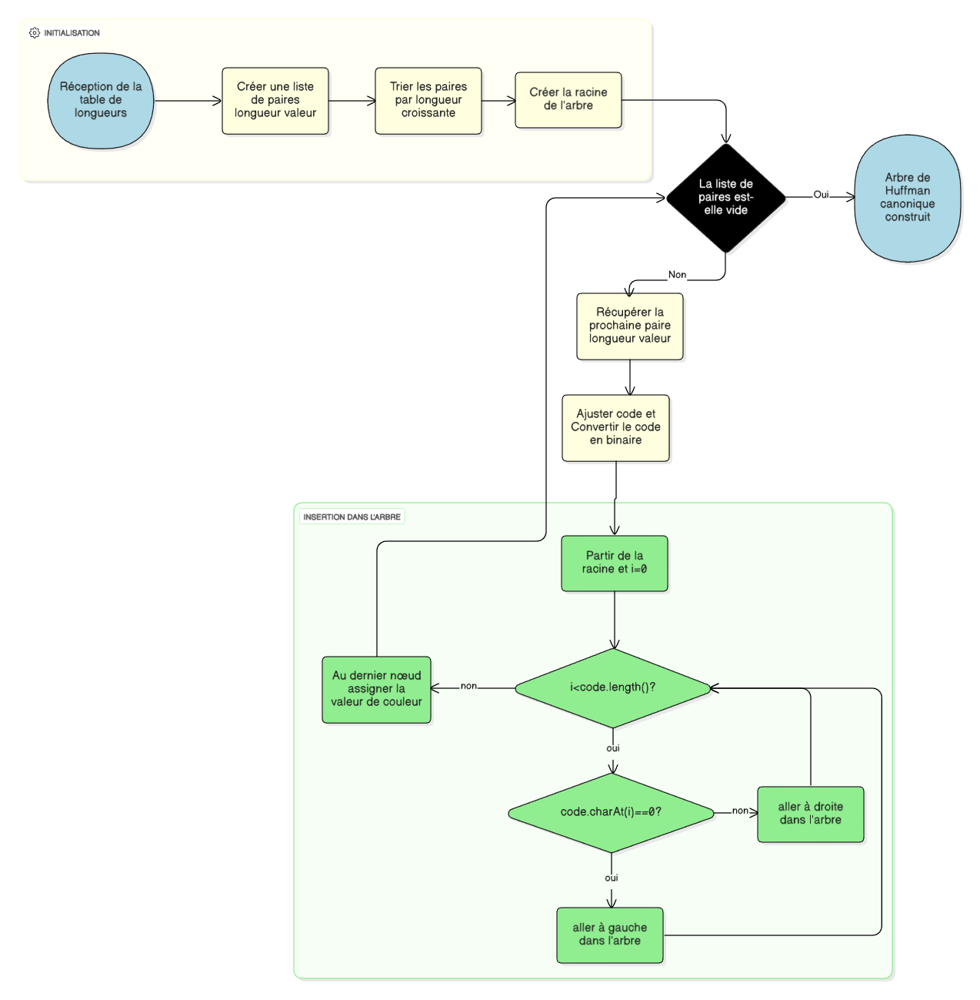
</div>

<div style="page-break-after: always;"></div>
<a id="visualisateur-decodage"></a>

# Visualisateur - Décodage des pixels

Maintenant que les arbres de Huffman sont construits pour chaque composante (rouge, vert, bleu), il est temps de décoder les pixels compressés pour reconstituer l'image.

## Le processus de décodage

La méthode `HuffmanDecodeur.decoder()` parcourt les données binaires compressées et reconstruit chaque pixel individuellement. Voici comment ça fonctionne :

### Pour chaque pixel de l'image :

1. Décodage de la composante rouge :
   - On part de la racine de l'arbre rouge
   - On lit les bits un par un dans les données compressées
   - Chaque bit **0** → on descend à **gauche** dans l'arbre
   - Chaque bit **1** → on descend à **droite** dans l'arbre
   - Quand on atteint une feuille, on récupère la valeur rouge (0-255)

2. Décodage de la composante verte :
   - Même processus, mais avec l'arbre vert
   - On continue la lecture des bits là où on s'était arrêté

3. Décodage de la composante bleue :
   - Même processus, mais avec l'arbre bleu
   - On continue la lecture des bits là où on s'était arrêté

4. Combinaison des composantes :
   - Les trois valeurs (rouge, vert, bleu) sont fusionnées en un seul entier RGB :
   ```java
   int pixel = (rouge << 16) | (vert << 8) | bleu;
   ```
Tous les codes couleurs RGB sont stockés sous la forme d'int dans un tableau. on parcourt ensuite ce tableau et on crée l'image sous la forme d'un objet `BufferedImage` qui va être retournée par la méthode `HuffmanDecodeur.decoder()`.

<div style="page-break-after: always;"></div>
<a id="visualisateur-affichage"></a>

# Visualisateur - Affichage de l'image

Une fois l'objet `BufferedImage` créé, il est transmis à la classe `FenetreVisualisateur` qui gère l'affichage de l'image dans une fenêtre graphique.

## Création de la fenêtre

Le constructeur de `FenetreVisualisateur` prend en paramètre :
- Le `BufferedImage` décodé
- Le nom de l'image (pour l'afficher dans le titre de la fenêtre)
- Les marges (optionnelles) pour calculer la taille optimale de la fenêtre

La fenêtre calcule automatiquement sa taille en fonction :
- De la taille de l'image
- De la taille de l'écran de l'utilisateur

L'image est mise à l'intérieur d'un `JScrollPane` qui est configuré pour le drag-and-drop.

## Le système de Drag-and-Drop

Lorsque l'image est plus grande que la fenêtre, un système de navigation à la souris permet de se déplacer dans l'image. Ce système est géré par la classe `NavigationSouris`.

### Fonctionnement

1. Détection : Le système vérifie si l'image dépasse les dimensions visibles de la fenêtre
2. Clic maintenu : Lorsque l'utilisateur clique et maintient le bouton gauche de la souris :
   - Le curseur change pour indiquer qu'un déplacement est possible
   - La position de départ est enregistrée
3. Déplacement : Pendant le glissement de la souris :
   - On calcule le déplacement : `déplacement = position actuelle - position précédente`
   - On met à jour les barres de défilement horizontale et verticale du `JScrollPane`
   - Les barres restent dans les limites (pas de dépassement au-delà de l'image)
4. Relâchement : Quand l'utilisateur relâche le bouton :
   - Le curseur revient à la normale
   - Le système arrête le suivi du déplacement

<div style="page-break-after: always;"></div>
<a id="visualisateur-classes"></a>

# Visualisateur - diagramme de classes

<div style="text-align: center; margin-top: 20px;">
    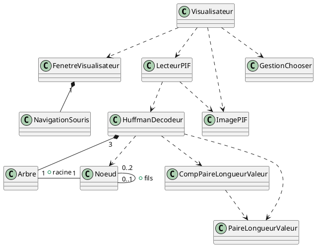
</div>

## Description des classes

- **Visualisateur** : Point d'entrée de l'application qui gère la sélection du fichier PIF, appelle le décodage et affiche l'image.
- **FenetreVisualisateur** : Fenêtre Swing qui affiche l'image décodée avec un système de redimensionnement automatique et de navigation par défilement.
- **LecteurPIF** : Classe statique qui lit les fichiers PIF.
- **ImagePIF** : Classe conteneur qui prend toutes les données d'une image PIF.
- **GestionChooser** : Classe statique qui gère l'interaction avec le `JFileChooser`.
- **NavigationSouris** : Gestionnaire d'événements souris qui permet de naviguer dans l'image par drag-and-drop lorsqu'elle dépasse la taille de la fenêtre.
- **CompPaireLongueurValeur** : Comparateur qui trie les paires longueur-valeur par longueur croissante puis par valeur pour la construction de l'arbre canonique.
- **HuffmanDecodeur** : Décodeur qui construit les arbres de Huffman canoniques pour chaque composante RGB et décode les pixels compressés.
- **PaireLongueurValeur** : Classe qui représente une association entre une longueur de code Huffman et une valeur de pixel (0-255).
- **Arbre** : Structure d'arbre.
- **Noeud** : Élément de l'arbre.

<div style="page-break-after: always;"></div>
<a id="exemple-usage"></a>

# Exemple d'usage

Ce projet utilise un **Makefile** pour automatiser la compilation et l'exécution. Voici les commandes disponibles:

## Commandes principales

| Commande | Description |
|:---------|:------------|
| `make visualisateur.jar` | Compile le JAR du visualisateur |
| `make convertisseur.jar`  | Compile le JAR du convertisseur  |
| `make run-visualisateur [img=res/image.pif]` | Lance le visualisateur (image optionnelle) |
| `make run-convertisseur [img=res/image.png] [dest=res/image.pif]` | Lance le convertisseur (image et destination optionnelles)|
| `make javadoc` | Génère la documentation |
| `make clean` | Supprime les fichiers générés |

